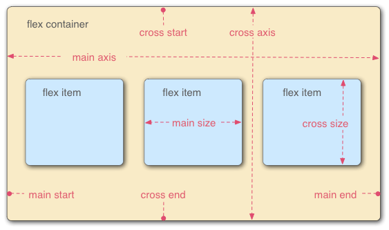

# Flexbox 레이아웃



- main axis: flex item이 배치되고 있는 방향으로 진행하는 축, 축의 시작과 끝을 main start, main end 라고 합니다.
- cross axis: flex item이 배치되는 방향의 수직을 이루는 축, 축의 시작과 끝을 cross start, cross end라고 합니다.
- display: flex가 설정된 부모 요소를 flex container라고 합니다.
- flex container 내부에 flexbox로 레이아웃되는 항목을 flex item이라고 합니다.

flexbox를 사용할 경우 요소의 크기와 순서를 유연하게 배치할 수 있습니다.

<br>
<br>

# 속성들

### flex-direction

기본 축이 진행되는 방향을 지정합니다.

- 기본 값은 row입니다. row는 보통 왼쪽에서 오른쪽으로 일렬로 배치됩니다.
- column으로 설정될 경우 위에서 아래로 배치됩니다.
- row-reverse, column-reverse의 경우 역방향으로 배치됩니다.

<br>

### justify-content

flex 요소의 수평 방향 정렬 방식을 설정합니다.

- flex-start: 기본값, 시작점부터 요소를 배치합니다.
- flex-end: 끝점부터 요소를 배치합니다.
- center: 가운데부터 요소를 배치합니다.
- space-between: 요소들 사이에만 여유를 두고 배치합니다.
- space-around: 요소들 양 옆 모두 여유를 두고 배치합니다.

<br>

### align-items

flex 요소의 수직 방향 정렬 방식을 설정합니다.

- stretch: 기본값, 요소의 높이를 컨테이너의 높이에 맞춰 늘려서 배치합니다.
- flex-start: 컨테이너의 시작에 배치합니다.
- flex-end: 컨테이너의 끝에 배치합니다.
- center: 컨테이너의 중간에 배치합니다.
- baseline: 컨테이너의 기준 선에 배치합니다.

<br>

### align-content

flex 라인의 수직 방향 정렬 방식을 설정합니다.

- stretch: 기본값, 요소의 높이를 컨테이너의 높이에 맞춰 늘려서 배치합니다.
- flex-start: flex 라인이 flex container 앞으로 이동합니다.
- flex-end: flex 라인이 flex container 끝으로 이동합니다.
- center: flex 라인이 flex container 중간으로 이동합니다.
- space-between: flex 라인이 flex container에 고르게 이동합니다.
- space-around: flex 라인이 flex container에 고르게 이동하는데, 양 옆에 공간을 남깁니다.

<br>

### flex-wrap

flexbox의 자식 요소가 컨테이너에서 이탈하여 깨지거나 안보이는 경우에 사용할 수 있습니다.

- no-wrap: 기본값, 요소가 다음 줄로 넘어가지 않습니다.
- wrap: 공간이 없다면 다음 줄로 넘어갑니다.
- wrap-reverse: 공간이 없다면 다음 줄로 넘어가는데, 역방향으로 넘어갑니다.

<br>

### flex

- 하나의 플렉스 아이템이 자신의 컨테이너가 차지하는 공간에 맞추기 위해 크기를 키우거나 줄이는 방법을 설정하는 속성입니다.
- `flex-grow`, `flex-shrink`, `flex-basis`의 단축 속성이며, 이 순서를 따릅니다.
- 값이 하나라면, `number`일 경우 `flex-grow`, `length` 또는 `percentage`일 경우 `flex-basis`입니다.
- 값이 두 개라면, 첫 번째 값은 `number`여야 하며, `flex-grow`가 됩니다. 두 번째 값은 `number`일 경우 `flex-shrink`, `length` ,`percentage` , `auto`일 경우 `flex-basis`입니다.
- 값이 세 개라면, `number` , `number`, `length` or `percentage` or `auto` 순서를 지켜야 합니다.

<br>

### flex-grow

`flex-item` 요소가, `flex-container` 요소 내부에서 할당 가능한 공간의 정도를 선언합니다. 만약 형제 요소로 렌더링 된 모든 `flex-item` 요소들이 동일한 `flex-grow` 값을 갖는다면, `flex-container` 내부에서 동일한 공간을 할당받습니다. 하지만 `flex-grow` 값으로 다른 소수값을 지정한다면, 그에 따라 다른 공간값을 나누어 할당받게 됩니다.

```css
/* <number> values */
flex-grow: 3;
flex-grow: 0.6;

/* Global values */
flex-grow: inherit;
flex-grow: initial;
flex-grow: unset;
```

<br>

### flex-shrink

`flex-item` 요소의 크기가 `flex-container` 요소의 크기보다 클 때 flex-shrink 속성을 사용하는데, 설정된 숫자값에 따라 `flex-container` 요소 내부에서 `flex-item` 요소의 크기가 **축소**됩니다.

```css
/* <number> values */
flex-shrink: 2;
flex-shrink: 0.6;

/* Global values */
flex-shrink: inherit;
flex-shrink: initial;
flex-shrink: unset;
```

<br>

### flex-basis

`flex-item`의 초기 크기를 지정합니다. `box-sizing`을 따로 지정하지 않는다면 콘텐츠 박스의 크기를 변경합니다.

```css
/* <'width'> 지정 */
flex-basis: 10em;
flex-basis: 3px;
flex-basis: auto;

/* 원본 크기 키워드 */
flex-basis: fill;
flex-basis: max-content;
flex-basis: min-content;
flex-basis: fit-content;

/* 플렉스 아이템 내용 크기에 따라 조절 */
flex-basis: content;

/* 전역 값 */
flex-basis: inherit;
flex-basis: initial;
flex-basis: unset;
```

<br>
<br>

# 참고

https://developer.mozilla.org/ko/docs/Learn/CSS/CSS_layout/Flexbox

https://developer.mozilla.org/ko/docs/Web/CSS/flex
