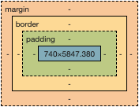

## margin과 padding

margin은 border의 바깥쪽에 존재하며, 다른 요소들과 거리를 두기 위해 사용합니다.

padding은 content와 border의 사이의 여백을 두기 위해 사용합니다.

### 방향

- `margin: 1px` 상하좌우 모두 1px
- `margin: 1px 2px` 상하 1px, 좌우 2px
- `margin: 1px 2px 3px` 상 1px, 좌우 2px, 하 3px
- `margin: 1px 2px 3px 4px` 상 1px, 우 2px, 하 3px, 좌 4px

### 두 가지의 차이점

- padding은 margin과 달리 음수 값을 적용할 수 없고 auto를 선언할 수 없습니다. 또한 병합이 일어나지 않습니다.

 

## margin 병합 (Margin Collapsing)

- 인접한 두 개 이상의 수직 방향 박스의 마진이 하나로 합쳐지는 것
- 좌우 마진에 대한 병합은 일어나지 않음
- 플로팅 요소와 절대 위치를 지정한 요소에 대해서는 일어나지 않음

### 발생 상황

- 인접 형제 요소간의 바깥 여백은 서로 상쇄됩니다.
- 부모와 자손을 분리하는 콘텐츠가 없을 때(아래의 경우) 부모와 자손의 margin이 병합, 상쇄된 margin은 부모 블록 바깥에 위치하게 됩니다.
    - 부모 블록에 테두리, 안쪽 여백, 인라인 부분이 없고 블록 서식 맥락이 생성되지 않았으며 부모의 `margin-top`을 자손의 `margin-top`과 분리할 권한이 없는 경우
    - 부모 블록에 테두리, 안쪽 여백, 인라인 콘텐츠가 없으며 부모의 `margin-bottom`과 자손의 `margin-bottom`을 분리할 `height`, `min-height`, `max-height`가 존재하지 않는 경우
- 빈 블록
    - 테두리, 안쪽 여백, 인라인 콘텐츠, `height`, `min-height`, `max-height`가 없으면 블록의 `margin-top`과 `margin-bottom`이 서로 상쇄
    

### 해결 방법

- 공간을 차지하는 요소를 넣어서 부모와 자식을 떨어지게 하기
    - `텍스트`, `border`, `padding` 등
- 비어있는 `table` 태그 넣기
- 자식 요소의 `display`를 `inline-block`으로 바꾸기
- 부모 요소의 속성 값으로 `overflow: hidden` 주기

 

## 참고

https://developer.mozilla.org/en-US/docs/Web/CSS/CSS_Box_Model/Mastering_margin_collapsing

[https://velog.io/@ursr0706/마진margin](https://velog.io/@ursr0706/%EB%A7%88%EC%A7%84margin)

[https://velog.io/@hyejin4169/CSS-margin-padding-차이점과-사용법-정리](https://velog.io/@hyejin4169/CSS-margin-padding-%EC%B0%A8%EC%9D%B4%EC%A0%90%EA%B3%BC-%EC%82%AC%EC%9A%A9%EB%B2%95-%EC%A0%95%EB%A6%AC)