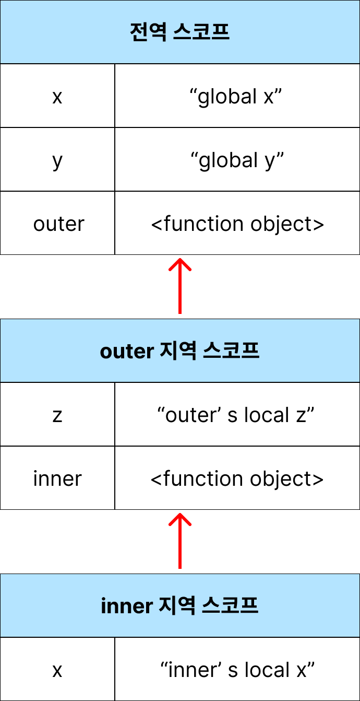

## Scope

- 식별자가 유효한 범위
- 식별자를 검색할 때 사용하는 규칙
  - 자바스크립트 엔진은 이름이 같은 두 개의 변수가 있다면 어떤 변수를 참조해야 할 것인지 결정해야 하는데(식별자 결정), 스코프를 통해 결정합니다.
- 스코프가 없다면 같은 이름을 갖는 변수끼리 충돌을 일으켜서 변수 이름을 하나 밖에 사용할 수 없을 것입니다.
- 스코프 내에서 식별자는 유일해야 하지만, 다른 스코프에는 같은 이름의 식별자를 사용할 수 있습니다.

### 전역 스코프

전역이란 코드의 가장 바깥 영역을 말합니다. 전역은 전역 스코프를 만듭니다.

전역에 변수를 선언하면 전역 스코프를 갖는 전역 변수가 되고, 전역 변수는 어디서든지 참조가 가능합니다.

### 지역 스코프

지역이란 함수 몸체 내부를 말합니다. 지역은 지역 스코프를 만듭니다.

지역에 변수를 선언하면 지역 스코프를 갖는 지역 변수가 되고, 지역 변수는 자신의 지역 스코프와 하위 지역 스코프에서 유효합니다.

### 함수 레벨 스코프

코드 블록이 아닌 함수에 의해서만 지역 스코프가 생성되는 것을 의미합니다.

`var` 키워드로 선언된 변수는 오로지 함수의 코드 블록만 지역 스코프로 인정합니다.

### 블록 레벨 스코프

블록 `{}`이 생성될 때마다 새로운 스코프가 형성되는 것을 의미합니다.

원래 자바스크립트는 함수 스코프를 따르지만, `let`과 `const` 키워드의 등장으로 블록 스코프를 형성하는 것도 가능해졌다.

### 렉시컬 스코프

함수를 어디서 정의했는지에 따라 함수의 상위 스코프를 결정하는 방식

<br>

## 스코프 체인

```jsx
var x = "global x";
var y = "global y";

function outer() {
  var z = "outer's local z";
  console.log(x); // global x
  console.log(y); // global y
  console.log(z); // outer's local z

  function inner() {
    var x = "inner's local x";
    console.log(x); // inner's local x
    console.log(y); // global y
    console.log(z); // outer's local z
  }
  inner();
}
outer();
console.log(x); // global x
console.log(y); // ReferenceError
```



스코프 체인은 스코프들이 계층적으로 연결된 것입니다. (실행 컨텍스트의 렉시컬 환경을 단방향으로 연결한 것)

- 모든 스코프는 하나의 계층적 구조로 연결되며, 모든 지역 스코프의 최상위 스코프는 전역 스코프

자바스크립트 엔진은 변수를 참조할 때 스코프 체인을 통해 변수를 참조하는 코드의 스코프에서 시작하여 상위 스코프 방향으로 이동하며 선언된 변수를 검색합니다. 그래서 상위 스코프에서 선언한 변수를 하위 스코프에서도 참조가 가능한 것입니다.

<br>

## 참고

모던 자바스크립트 13-스코프
