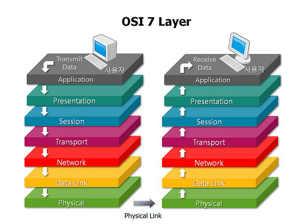
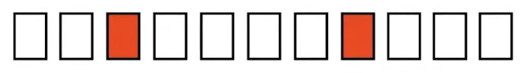
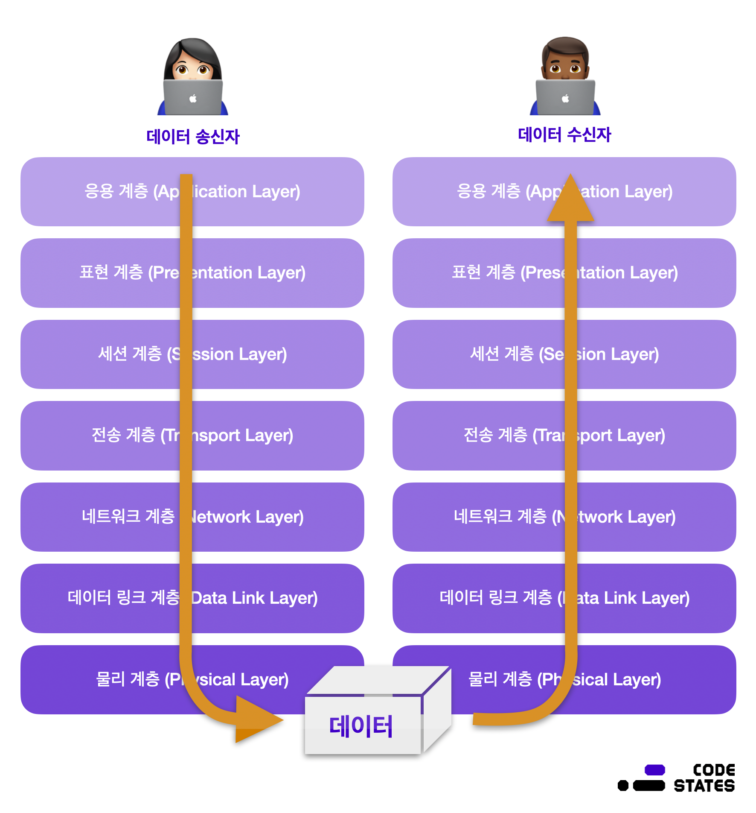

# OSI 7계층

OSI 7계층은 국제표준기구 iso가 발표한 네트워크 모델입니다.. OSI 모델은 응용 계층(Application Layer), 표현 계층(Presentation Layer), 세션 계층(Session Layer), 전송 계층(Transport Layer), 네트워크 계층(Network Layer), 데이터 링크 계층(Data link Layer), 물리 계층(Physical Layer)로 7개 계층으로 나누어져 있습니다.

여담으로 전공 수업 때 “물데네전세표응”로 외웠습니다.

### 응용 계층(Application Layer)

응용 프로세스를 직접 사용하여 직접적인 응용 서비스를 수행합니다. 사용자와 직접 연결되어 네트워크 접근을 돕는 계층으로 데이터 전송을 위한 **인터페이스**를 제공하며 사용자가 입력한 데이터를 하위 계층으로 전달합니다. \*\*\*\*흔히 사용하고 있는 HTTP, FTP, SMTP등과 같은 프로토콜들이 속한 계층입니다.

### 표현 계층(Presentation Layer)

**응용 계층으로 전달하거나 전달받는 데이터를 인코딩 또는 디코딩**하는 계층입니다. 서로 다른 통신 기기 간에 다른 인코딩을 사용할 수 있기 때문에 해당 계층에서 데이터 변환이 일어납니다. 일종의 번역기 같은 역할을 수행하는 계층이라고 볼 수 있습니다.

예) 문자열을 아스키 코드로 변환

### 세션 계층(Session Layer)

컴퓨터 간의 연결인 세션 연결의 설정과 해제, 세션 메시지 전송 등의 기능을 수행하며 **세션의 생성과 유지**를 관리하는 계층입니다. 즉, 컴퓨터 간의 통신 방식에 대해 결정하는 계층이라고 할 수 있습니다. 쉽게 말해, 양 끝 단의 프로세스가 연결을 성립하도록 도와주고, 작업을 마친 후에는 연결을 끊는 역할을 합니다.

오류가 발생한다면 해당 계층에서 복구를 수행합니다.

### 전송 계층(Trnasport Layer)

컴퓨터 간 **신뢰성 있는 데이터**를 서로 주고받을 수 있도록 하는 서비스를 제공하며 데이터 전송 방식을 결정하는 계층입니다. 하위 계층에서 신호와 데이터를 올바른 위치로 보내고 신호를 만드는데 집중했다면, 전송 계층에서는 해당 데이터들이 실제로 정상적으로 보내지는지 확인하는 역할을 합니다. 네트워크 계층에서 사용되는 패킷을 나누어 전송하고, 전송에 실패하여 유실되거나 순서가 바뀌는 경우 다시 패킷을 보내는 등의 역할을 수행합니다.

예) TCP/UDP 연결

### 네트워크 계층(Network Layer)

OSI 7 계층에서 가장 복잡한 계층 중 하나로서 실제 네트워크 간에 데이터 라우팅을 담당합니다. 이때 라우팅이란 어떤 네트워크 안에서 통신 데이터를 짜인 알고리즘에 의해 최대한 빠르게 보낼 최적의 경로를 선택하는 과정을 라우팅이라고 합니다.

즉, 논리적 주소(IP)를 기반으로 출발지에서 목적지까지 가는 데이터 경로와 우선 순위를 결정하는 계층입니다.

예) IP 패킷 전송

### 데이터 링크 계층(Data Link Layer)

네트워크 계층과 데이터 링크 계층은 서로 비슷한 점이 많습니다. 큰 차이점이 있다면 네트워크 계층은 서로 다른 네트워크 간의 데이터 전송을 담당한다면, 데이터 링크 계층은 동일한 네트워크 내에서 전송을 담당합니다.

데이터를 전송할 때 물리적 주소를 기반으로 노드대 노드(Point-To-Point)로 데이터 전송 형태를 결정합니다. 물리적 주소는 MAC주소라 하며 LAN카드에 부여받은 고유한 주소로써 하드웨어를 구별합니다. 즉, 물리적인 기기들 사이에서 데이터를 전송하는 역할을 합니다.

또한, 전송 계층처럼 오류 제어와 흐름 제어를 제공합니다. 데이터 링크 계층의 데이터 단위를 “Frame”이라고 부릅니다.

위의 이미지와 같이 데이터가 10개의 Frame이 존재하고 2개의 프레임이 오류가 났을 때 데이터 링크 계층에서는 이 2개의 데이터를 그냥 버립니다. 그의 반면에 전송 계층에서의 오류제어는 해당 데이터가 없으면 다시 보내 줌으로써 오류 복구까지 수행합니다.

데이터 링크 계층은 물리 계층과 상당히 밀접한 관계에 있습니다. 물리 계층이 UTP 구간이라면 이더넷 방식으로, Serial 구간이면 HDLC, PPP 방식으로 결정되어집니다. 즉, 도로가 차도이며 자동차나 버스, 트럭으로 데이터를 전달하고, 철도이면 기차나 지하철 방식으로 도로 형태에 맞게 운송수단이 결정되듯 물리 계층으로의 데이터 전송 방식을 결정하는 계층이 바로 데이터 링크 계층입니다.

### 물리 계층(Physical Layer)

물리 계층은 데이터 링크 계층에서 만들어진 프레임(데이터)들을 컴퓨터가 이해할 수 있는 2진수 bit로 변환하고 전기적인 신호로써 전송로를 통해 목적지까지 실질적인 데이터를 전달하는 계층입니다.

예) 디지털 또는 아날로그로 신호 변경

### 데이터 캡슐화

OSI 7계층 모델은 송신 측의 7계층과 수신 측의 7계층을 통해 데이터를 주고받습니다. 각 계층은 독립적이므로 데이터가 전달되는 동안에 다른 계층의 영향을 받지 않습니다.

데이터를 전송하는 쪽은 데이터를 보내기 위해서 상위 계층에서 하위 계층으로 데이터를 전달합니다. 이때 데이터를 상대방에게 보낼 때 각 계층에서 필요한 정보를 데이터에 추가하는데 이 정보를 **헤더**(데이터링크 계층에서는 트레일러)라고 합니다. 그리고 이렇게 헤더를 붙여나가는 것을 **캡슐화**라고 합니다.

마지막 물리 계층에 도달하며 송신 측의 데이터링크 계층에서 만들어진 데이터가 전기 신호로 변환되어 수신 측에 전송됩니다.

데이터를 받는 쪽은 하위 계층에서 상위 계층으로 각 계층을 통해 전달된 데이터를 받게 됩니다. 이때 상위 계층으로 데이터를 전달하며 각 계층에서 헤더(데이터링크 계층에서는 트레일러)를 제거해 나가는 것을 **역캡슐화**라고 합니다. 역캡슐화를 거쳐 마지막 응용 계층에 도달하면 드디어 전달하고자 했던 원본 데이터만 남게 됩니다.

[참고 사이트]

- [코드스테이츠 유어클래스 S3U6](https://urclass.codestates.com/content/1f34960b-6156-48a3-8eee-b200cd802640?playlist=2297)
- [10분 테코톡 히히의 OSI 7계층](https://www.youtube.com/watch?v=1pfTxp25MA8)
- [10분 테코톡 이오의 OSI 7계층](https://www.youtube.com/watch?v=wuOzMvNEzAg)
- [10분 테코톡 파즈의 OSI 7계층](https://www.youtube.com/watch?v=Fl_PSiIwtEo)
- [https://mindnet.tistory.com/entry/네트워크-쉽게-이해하기-14편-물데네전세표응-ㅡ-OSI-하위계층](https://mindnet.tistory.com/entry/%EB%84%A4%ED%8A%B8%EC%9B%8C%ED%81%AC-%EC%89%BD%EA%B2%8C-%EC%9D%B4%ED%95%B4%ED%95%98%EA%B8%B0-14%ED%8E%B8-%EB%AC%BC%EB%8D%B0%EB%84%A4%EC%A0%84%EC%84%B8%ED%91%9C%EC%9D%91-%E3%85%A1-OSI-%ED%95%98%EC%9C%84%EA%B3%84%EC%B8%B5)
