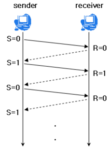
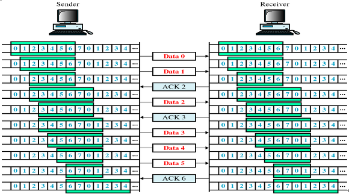
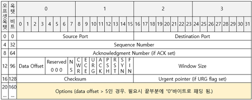
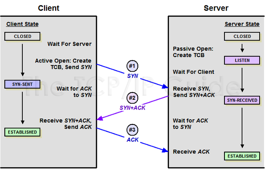
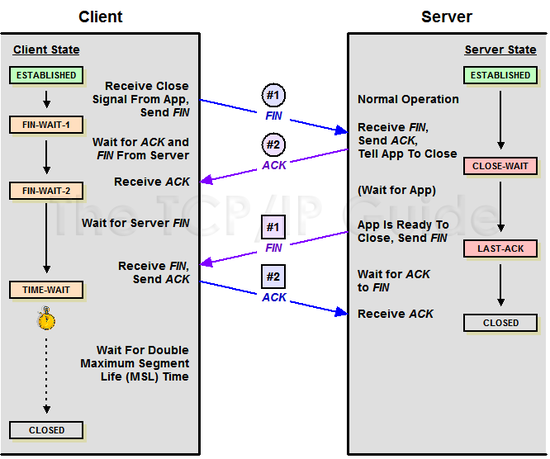
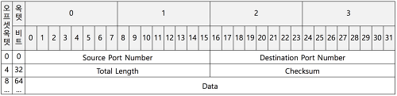

# TCP (Transmission Control Protocol)

TCP는 인터넷 프로토콜 스위트의 핵심 프로토콜 중 하나입니다.

TCP는 웹 브라우저들이 WWW에서 서버에 연결될 때 사용되고, 이메일 전송이나 파일 전송에도 사용됩니다.

TCP는 애플리케이션에게 신뢰적이고 연결지향성 서비스를 제공합니다.

TCP는 전송 계층에 위치합니다.

만약 안정성을 필요로 하지 않을 경우, TCP 대신 UDP를 사용할 수 있습니다.

 

## 특징

- 연결지향: 3 way handshake를 통해 상태를 확인하고 프로세스를 진행하므로 무의미한 데이터 전송 방지
- 순서보장: TCP/IP 패킷에 담긴 순서 정보와 받은 데이터에서의 순서 정보가 다르다면 재요청

 

## 흐름 제어

- 송신 측에서 수신 측의 데이터 처리 속도 차이를 해결하기 위한 기법
- 수신 측이 너무 많은 패킷을 받지 않기 위함입니다.

### **Stop-And-Wait**

- 매번 전송한 패킷에 대한 확인 응답을 받아야만 그 다음 패킷을 전송하는 기법

### **Sliding Window (Go-Back-n ARQ)**

- 수신 측에서 설정한 윈도우 크기만큼 송신측에서 패킷 각각에 대한 확인 응답없이 세그먼트를 전송하게 하고, 데이터 흐름을 동적으로 조절하는 기법
- 수신 측이 한 번에 처리할 수 있는 데이터의 양(윈도우 크기)을 3 way handshake할 때 송신 측에 전달합니다.
- 상대방에게 응답을 받지 않아도 범위 내에서 데이터를 보낼 수 있습니다.
- 패킷의 왕복 시간(RTT)이 크다면 네트워크가 혼잡하다고 생각하여 윈도우 크기를 실제 버퍼의 크기보다 작게 설정합니다.
- 통신 과정 중에도 네트워크 혼잡 등의 조건을 통해 윈도우 크기는 유동적으로 설정됩니다.

 

## 오류 제어

오류 검출과 재전송을 포함합니다.

TCP에서 오류를 파악하는 방법

1. 수신 측에서 송신 측으로 NAK를 전송
2. 전송한 패킷에 대한 ACK가 오지 않거나 중복된 ACK가 전송

ARQ(Automatic Repeat Request) 기법

- 프레임이 손상되었거나 손실되었을 경우에 재전송을 통해 오류를 복구합니다.

### Stop And Wait ARQ

- 송신 측에서 1개의 프레임을 송신하고, 수신 측에서 수신된 프레이의에러 유무에 따라 ACK or NAK를 보내는 방식
- 식별을 위해서 데이터, ACK 프레임을 0, 1 번호를 번갈아가면서 부여합니다.
- 수신 측에서 데이터를 받지 못했다면 NAK를 보냅니다. 송신 측에서 NAK를 받으면 데이터를 재전송합니다.

### Go-Back-n ARQ

- 전송된 프레임이 손상 혹은 분실됐거나 ACK 패킷이 손실도어 타임아웃이 발생했다면 확인된 마지막 프레임 이후로 모든 프레임을 재전송합니다.
- 슬라이딩 윈도우는 연속적인 프레임 전송 기법으로 전송 측은 전송된 프레임의 복사본을 갖고 있어야 하고 ACK와 NAK를 구별해야 합니다.

### Selective Reject ARQ

- Go-Back-n ARQ에서 모든 프레임을 재전송하는 단점을 보완한 기법입니다.
- 손상된 프레임만 재전송합니다. 따라서 별도로 데이터 재정렬을 수행해야 하기 때문에 별도의 버퍼를 필요로 합니다. 그래서 비용과 유지관리 부분이 Go-Back-n ARQ보다 비쌉니다.

 

## 혼잡 제어

네트워크 내의 패킷의 수가 과도하게 증가하는 현상을 혼잡이라 하고, 이 혼잡 현상을 예방하거나 없애는 것을 혼잡제어라고 합니다.

### **AIMD(Additive Increase / Multiplicative Decrease)**

- 처음에 패킷을 하나씩 보내고 문제없이 도착하면 window 크기를 1씩 증가시켜가며 전송하는 방법
- 패킷 전송에 실패하거나 일정 시간을 넘으면 패킷의 보내는 속도를 절반으로 줄입니다.
- 여러 호스트가 한 네트워크를 공유하고 있으면 나중에 진입하는 쪽이 처음에는 불리하지만, 시간이 흐르면 평형상태로 수렴하게 됩니다.
- 문제점
    - 네트워크의 높은 대역폭을 사용하지 못하여 오랜 시간이 걸리게 되고, 네트워크가 혼잡해지는 상황을 미리 감지하지 못합니다.

### **Slow Start**

- AIMD 처럼 패킷을 하나씩 보내면서 시작하고, 패킷이 문제없이 도착하면 각각의 ACK 패킷마다 window size를 1씩 늘려줍니다. 즉, 한 주기가 지나면 window size가 2배가 됩니다.
- 전송속도는 AIMD에 반해 지수 함수 꼴로 증가합니다. 만약 혼잡 현상이 발생하면 window size를 1로 떨어뜨립니다.

### **Fast Retransmit**

- 패킷을 받는 쪽에서 먼저 도착해야할 패킷이 도착하지 않고 다음 패킷이 도착한 경우에도 ACK 패킷을 보내게 된다.
- 순서대로 잘 도착한 마지막 패킷의 다음 패킷의 순번을 ACK 패킷에 실어서 보내게 되므로, 중간에 하나가 손실되게 되면 송신 측에서는 순번이 중복된 ACK 패킷을 받게 됩니다. 이것을 감지하는 순간 문제가 되는 순번의 패킷을 재전송 해줄 수 있다.
- 중복된 순번의 패킷을 3개 받으면 재전송을 하게 됩니다. 약간 혼잡한 상황이 일어난 것이므로 혼잡을 감지하고 window size를 줄입니다.

### **Fast Recovery**

- 혼잡한 상태가 되면 window size를 1로 줄이지 않고 반으로 줄이고 선형증가시키는 방법입니다.
- 이것이 적용됨면 혼잡 상황을 한번 겪고 나서부터는 순수한 AIMD 방식으로 동작하게 됩니다.

 

## TCP 헤더

### Source Port, Destination Port

- 16bit, 16bit
- 0~65536 중 하나의 포트를 사용합니다.
- 클라이언트와 웹 서버를 HTTPS를 사용해서 연결한다면 Source Port에는 클라이언트의 랜덤 포트가 들어가고 Destination Port에는 443포트가 들어가게 될 것입니다.

### Sequence Number

- 32bit
- 데이터의 고유한 번호입니다. SYN Flag를 설정했을 때 사용됩니다.
- 이 번호로 수신 측에서 중복된 데이터를 폐기할 수 있고, 순서가 바뀌었을 때 올바른 순서로 재구성할 수 있습니다.
- ISN(Initial Seqence Number): TCP에서 새로운 연결을 할 때마다 새로운 sequence number를 사용하는데 랜덤하게 골라서 보내지는 번호
- ISN 값은 4ms마다 sequence number가 변화되므로 4.55시간에 한 번씩 같아질 수 있습니다. 하지만 네트워크에서 패킷 유효시간(MSL)은 4.55시간 보다 작기 때문에 항상 고유하다고 할 수 있습니다.
- MSL(Maximum Segment Lifetime): 네트워크에 패킷이 유효한 시간. 보통 2분 정도.

### **Acknowledgment Number**

- 32bit
- 데이터 수신 응답 번호입니다.
- 송신 측에서 SYN을 보내면, 수신측에서 받은 SYN에 +1을 해서 ACK Number로 보냅니다.

### **Data Offset**

- 4bit
- TCP 헤더의 크기 값
- 헤더의 크기는 최소 20byte, 최대 60byte
- 최소가 20byte인 이유는 헤더의 Option을 제외한 다른 필드들의 합이 20byte이기 때문입니다.

### Reserved

- 3bit
- 미래를 위해서 만들어진 예비 필드, 항상 0으로 설정되어 있어야 합니다.

### Flags

- 9bit
- 세그먼트의 용도와 내용을 결정합니다.

| URG | Urgent Pointer, 필드의 값이 유효한지 나타냅니다. 긴급하게 전달할 내용이 있을 경우 플래그가 on이 되고 다른 데이터에 비해 높은 우선순위를 가지게 됩니다. |
| --- | --- |
| ACK | 패킷을 받았다는 것을 알려줍니다. |
| PSH | Push, 버퍼가 채워지기를 기다리지 않고 데이터를 바로 전달합니다. (7계층인 응용계층으로) |
| RST | Reset, 이 플래그가 활성화되면 세션을 끊습니다. (비정상종료) |
| SYN | 동기화, TCP 세션을 만들 때 가장 먼저 보내는 패킷입니다. |
| FIN | Finish, 세션의 연결을 종료시킬 때 사용됩니다. (정상종료) |
| NS | ECN-nonce, 은폐 보호 |
| CWR | 혼잡 윈도우 축소, 혼잡 제어 메커니즘에 의해 응답했음을 알리는 의미입니다. |
| ECE | ECN-Echo, 해당 필드가 1이면서 SYN이 1일 때는 ECN을 사용한다고 알리는 것입니다. |

### Window Size

- 16bit
- 수신하고자 하는 윈도우의 크기입니다.

### Checksum

- 16bit
- 오류 검출을 위해 사용됩닏.
- 헤더 및 데이터를 16bit 단위로 분할하여 비트 합을 구한 뒤 1의 보수를 취한 값입니다. 이 체크섬을 삽입하여 수신하면 송신 측에서 알고리즘으로 계산한 뒤 동일한지 판단합니다.

### Urgent Pointer

- 16bit
- URG 플래그가 설정된 경우, 긴급한 데이터가 시작되는 위치를 가르키는 필드

### Options

- 0byte~40byte
- TCP 헤더는 기본 20byte입니다. Options 필드를 포함했을 경우 TCP 헤더의 크기가 최대 60byte로 늘어날 수 있습니다. TCP 헤더의 길이가 20 이상이라면 options 필드를 체크해야 합니다.

| 0 (8 비트) | End of options list |
| --- | --- |
| 1 (8 비트) | No operation (NOP, Padding) 이것은 속도 향상을 위해 옵션 필드를 32 비트 길이에 맞추기 위해 사용될 수 있습니다. |
| 2,4,SS (32 비트) | Maximum segment size |
| 3,3,S (24 비트) | Window scale  |
| 4,2 (16 비트) | Selective Acknowledgement permitted. |
| 5,N,BBBB,EEEE,... (variable bits, N is either 10, 18, 26, or 34)- Selective ACKnowledgement (SACK) | 이 첫 2 바이트 뒤에는 선택적 확인응답을 받는 1-4개 블럭의 리스트가 따라오게 되며, 이들은 32 비트 시작/종료 포인터로 구분됩니다. |
| 8,10,TTTT,EEEE (80 비트) | Timestamp and echo of previous timestamp |
| 14,3,S (24 비트) | TCP Alternate Checksum Request. |
| 15,N,... (가변 비트) | TCP Alternate Checksum Data. |

### Padding

- TCP 헤더의 종료 지점과 데이터의 시작 지점을 32 비트 단위 길이에 맞추기 위해 사용됩니다.

 

## **3-Way Handshake**

3 Way-Handshake란 TCP/IP 프로토콜을 이용해서 통신을 하는 프로그램이 데이터를 전송하기 전에 상대방 컴퓨터와 사전에 세션을 수립하는 과정입니다.

1단계

- 클라이언트가 서버와 연결을 설정하기 위해서 어떤 시퀀스 번호로 세그먼트를 시작할지 알려주는 SYN이 포함된 세그먼트를 보냅니다.

2단계

- 서버는 SYN를 받고 SYN-ACK 패킷을 보냅니다.

3단계

- 클라이언트가 서버의 응답을 승인하고 ACK를 보낸 뒤, 실제 데이터 전송을 시작할 수 있는 안정적인 연결을 수립합니다.

 

## 4-way handshake

TCP/IP 환경에서 클라이언트와 서버의 연결을 해제하는데 필요한 프로세스입니다.

1단계

- 클라이언트에서 서버와의 연결 종료를 위해서 서버에 FIN 패킷을 보냅니다.

2단계

- 서버가 클라이언트에게 FIN을 받았다면 응답으로 ACK를 보냅니다.

3단계

- 서버가 연결을 종료할 준비가 되면 클라이언트에게 FIN을 보냅니다.

4단계

- 클라이언트는 서버에게 ACK를 보냅니다.

이 과정을 진행하면 안전하게 세션을 종료할 수 있게 됩니다.

 
 

# UDP(User Datagram Protocol)

UDP는 비연결형 서비스를 지원하는 프로토콜이며, 전송계층에 위치합니다. 

TCP처럼 서로 보내고 받는다는 상태를 확인하지 않고, 바로 보내는 프로토콜입니다.

비연결형, 신뢰성이 없는 프로토콜입니다.

HTTP/3 에서는 TCP 대신 UDP를 채택하였습니다.

 

## 특징

- 신뢰성은 낮지만 연속성은 높습니다.
- 데이터그램 방식을 제공합니다.
- 전송 속도가 빠릅니다.
- 1:1. 1:N, N:N 통신이 가능합니다.

 

## UDP Header

### Source Port, Destination Port

- source port는 메시지를 보내는 측의 번호, destination port는 메시지를 받는 측의 번호입니다.

### Total Length

- 헤더와 데이터를 합한 사용자 데이터그램의 전체 길이입니다.
- 8바이트부터 65507바이트까지입니다.

### Checksum

- 오류를 탐지하기 위해 사용됩니다.
- 선택사항입니다.

 

## DNS에서 UDP를 사용하는 이유?

Request 양이 작고, 3 way handshake로 연결을 유지할 필요가 없습니다. 또한 Request에 대한 손실은 Application Layer에서 제어가 가능합니다.

 
 

# 참고

[https://ko.wikipedia.org/wiki/전송_제어_프로토콜](https://ko.wikipedia.org/wiki/%EC%A0%84%EC%86%A1_%EC%A0%9C%EC%96%B4_%ED%94%84%EB%A1%9C%ED%86%A0%EC%BD%9C)

[https://velog.io/@inourbubble2/TCP-Header를-알면-TCP를-이해할-수-있다](https://velog.io/@inourbubble2/TCP-Header%EB%A5%BC-%EC%95%8C%EB%A9%B4-TCP%EB%A5%BC-%EC%9D%B4%ED%95%B4%ED%95%A0-%EC%88%98-%EC%9E%88%EB%8B%A4#%EC%84%B8%EA%B7%B8%EB%A8%BC%ED%8A%B8%EC%9D%98-%EC%9A%A9%EB%8F%84%EC%99%80-%EB%82%B4%EC%9A%A9%EC%9D%84-%EA%B2%B0%EC%A0%95%ED%95%98%EB%8A%94-%ED%94%8C%EB%9E%98%EA%B7%B8)

https://hand-over.tistory.com/15

https://hahahoho5915.tistory.com/15

[https://velog.io/@haero_kim/TCP-흐름제어-기법-살펴보기](https://velog.io/@haero_kim/TCP-%ED%9D%90%EB%A6%84%EC%A0%9C%EC%96%B4-%EA%B8%B0%EB%B2%95-%EC%82%B4%ED%8E%B4%EB%B3%B4%EA%B8%B0)

https://benlee73.tistory.com/186

[https://gyoogle.dev/blog/computer-science/network/흐름제어 & 혼잡제어.html](https://gyoogle.dev/blog/computer-science/network/%ED%9D%90%EB%A6%84%EC%A0%9C%EC%96%B4%20&%20%ED%98%BC%EC%9E%A1%EC%A0%9C%EC%96%B4.html)