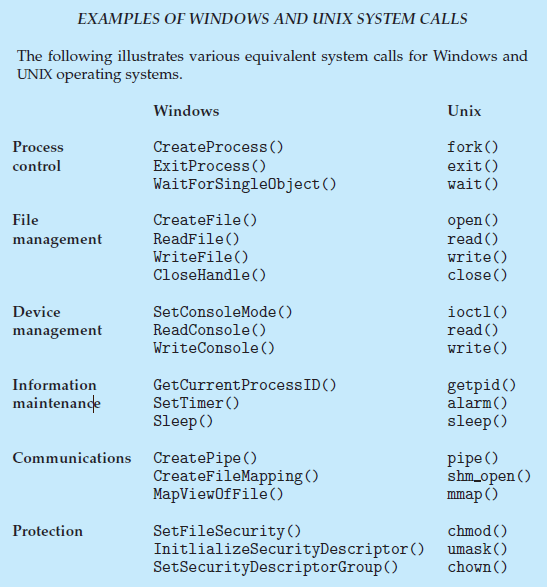

# 운영체제의 이중 동작 모드

운영체제는 사용자 모드와 커널 모드로 나누어져 동작합니다. 이렇게 두 가지 모드로 나누어져 동작하는 것을 이중 동작 모드(Dual Mode)라고 합니다.

사용자가 사용하는 응용 프로그램은 사용자 모드에서 작동이 됩니다. 프로그램이 운영체제에게 시스템 사용을 요청하게 되면 커널 모드로 바꾸어서 요청된 시스템을 실행한 뒤, 다시 사용자 모드로 전환합니다.

만약, 사용자 모드에서 특권 명령을 실행하려고 하면 CPU에서 내부 인터럽트를 발생시켜 해당 명령어를 요청한 프로그램을 강제로 종료시킵니다.

> 특권 명령에는 인터럽트 핸들링, 사용자 모드에서 커널 모드로 전환, 입출력 관리 등이 있습니다.
> 

커널 모드와 사용자 모드를 구분 짓기 위해서 모드 비트(mode bit)라고 하는 1개의 비트가 컴퓨터의 하드웨어에 추가되었습니다. 이 비트는 커널 모드(0) 또는 사용자 모드(1)를 나타냅니다. 모드 비트로 운영체제를 위해 실행되는 작업과 사용자를 위해 실행되는 작업을 구분할 수 있습니다.

시스템 부트 시 하드웨어는 커널 모드에서 시작합니다. 이어서 운영체제가 적재되고, 사용자 모드에서 사용자 프로세스가 시작됩니다. 트랩이나 인터럽트가 발생할 때마다 하드웨어는 사용자 모드에서 커널 모드로 전환합니다. 이것은 운영체제가 컴퓨터의 제어를 얻을 때마다 항상 커널 모드에 있게 된다는 것을 의미합니다. 시스템은 사용자 프로그램으로 제어를 넘기기 전에 항상 사용자 모드로 전환합니다.

전환 요약

1. 컴퓨터 부팅 과정 - 커널 모드
2. 앱 실행 과정 - 커널 모드
3. 앱 실행 중 - 사용자 모드
4. 인터럽트 발생 후 처리 과정 - 커널 모드
5. 인터럽트 처리 후 - 사용자 모드

### 왜 이중 동작 모드로 동작해야 하나요?

**보안 강화**

커널 모드에서 실행되는 커널은 하드웨어에 직접 액세스하고 중요한 시스템 리소스를 제어합니다. 반면에 사용자 애플리케이션은 더 제한적인 사용자 모드에서 실행됩니다. 이러한 분리를 통해 사용자 수준 프로세스는 커널이나 사용자 모드에서 실행되는 다른 프로세스의 무결성을 방해하거나 손상시킬 수 없습니다. 민감한 시스템 기능 및 데이터에 대한 무단 액세스를 방지합니다.

**안정성**

운영체제는 사용자 모드와 커널 모드를 분리하여 안정성을 추구합니다. 사용자 모드에서는 프로세스가 서로 격리됩니다. 즉, 한 프로세스의 충돌이나 오작동이 전체 시스템에 영향을 미칠 가능성이 적습니다. 커널 모드에서 실행되는 커널은 계속해서 독립적으로 작동할 수 있으므로 내결함성과 시스템 안정성이 향상됩니다.

**리소스의 효율적인 관리**

커널 모드의 커널은 CPU 시간, 메모리 및 기타 하드웨어 리소스의 할당과 관리를 완전히 제어합니다. 사용자 프로세스는 제어된 인터페이스(시스템 호출)를 통해 이러한 리소스를 요청하여 공정하고 안전한 리소스 배포를 보장합니다.

<br>

# 시스템 콜

위에서 설명한 이중 동작 모드에서 사용자 모드 → 커널 모드로 전환하기 위해서 필요한 인터페이스가 시스템 콜입니다.

<br>

### 시스템 콜의 과정

1. **사용자 응용 프로그램 요청**: 사용자 응용 프로그램이 운영 체제에서 관리하는 리소스 또는 권한 있는 액세스가 필요한 작업을 수행해야 할 때 프로세스가 시작됩니다. 이는 파일 읽기, 새 프로세스 생성, 메모리 할당과 같은 작업일 수 있습니다.
2. **라이브러리 기능 또는 언어 바인딩**: 대부분의 사용자 응용 프로그램은 시스템 호출을 직접 수행하지 않습니다. 대신 라이브러리나 언어 바인딩에서 제공하는 높은 수준의 추상화를 사용합니다. 예를 들어 C에서는 C 표준 라이브러리의 일부이고 시스템 호출을 사용하여 구현되는 'fopen', 'fork' 또는 'malloc'과 같은 함수를 사용할 수 있습니다.
3. **커널 모드로 전환**: 전환은 특수 소프트웨어 인터럽트 또는 명령을 사용하여 수행됩니다. x86 기반 시스템에서는 "int 0x80" 또는 "syscall" 명령이 일반적으로 이 목적으로 사용됩니다.
4. **저장 상태**: 커널 모드로 전환하기 전에 CPU는 프로그램 카운터, 레지스터 및 기타 관련 정보를 포함하여 사용자 수준 프로그램의 현재 상태를 "프로세스 제어 블록"(PCB)이라는 데이터 구조에 저장합니다. 이를 통해 운영 체제는 나중에 시스템 호출 처리가 완료되면 사용자 수준 프로그램의 상태를 복원할 수 있습니다.
5. **커널 모드 실행**: 커널 모드에 들어가면 운영 체제는 특정 레지스터나 메모리 위치(예: x86 어셈블리의 EAX 레지스터)에 전달된 값을 검사하여 사용자 수준 프로그램에서 요청한 시스템 호출을 식별합니다. 이 값은 적절한 시스템 호출 처리기에 요청을 전달하는 데 사용되는 특정 시스템 호출 번호에 해당합니다.
6. **시스템 콜 처리**: 운영 체제는 해당 시스템 호출 처리기를 호출합니다. 각 시스템 호출에는 운영 체제 커널 내에서 자체 처리기 기능이 있습니다. 이러한 핸들러는 하드웨어와의 상호 작용, 리소스 관리 또는 기타 권한 있는 작업 수행을 포함하는 요청된 작업을 실행하는 일을 담당합니다.
7. **반환 값**: 시스템 호출 처리기는 작업을 완료한 후 일반적으로 결과나 오류 코드를 사용자 수준 프로그램에 반환합니다. 이 결과는 종종 지정된 CPU 레지스터나 메모리 위치에 저장됩니다.
8. **사용자 응용 프로그램 상태 복원**: 시스템 호출이 완료되면 운영 체제는 PCB에서 저장된 사용자 수준 프로그램 상태를 검색하고 프로그램 카운터 및 레지스터를 포함하여 이를 복원합니다. 이를 통해 사용자 수준 프로그램은 마치 한 번도 떠나지 않은 것처럼 계속 실행될 수 있습니다.
9. **사용자 모드로 돌아가기**: 마지막으로 제어권은 사용자 수준 프로그램으로 반환되며, 이제 시스템 호출 작업의 결과로 해당 코드를 계속 실행할 수 있습니다.

<br>

### 시스템 콜의 예시

```bash
cp in.txt out.txt
```

`cp` 프로그램을 실행시키면 `in.txt` 파일이 현재 디렉터리에서 접근할 수 있는지 검사하기 위해서 시스템 콜을 호출합니다. 파일이 존재하지 않는다면 에러를 발생시키고 종료하는데, 이 때 시스템 콜이 사용됩니다.

만약 파일이 존재한다면 `out.txt` 을 검사합니다. 파일 명이 존재하는지 안하는지 시스템 콜을 통해 확인합니다.

존재한다면 덮어씌울지, 이어 붙일지 user에게 물어볼 수 있고, 존재하지 않는다면 파일을 저장하는데 이 때도 시스템 콜을 사용합니다.

<br>

### 시스템 콜의 유형



<br>

# 참고

https://neos518.tistory.com/115

https://fjvbn2003.tistory.com/306