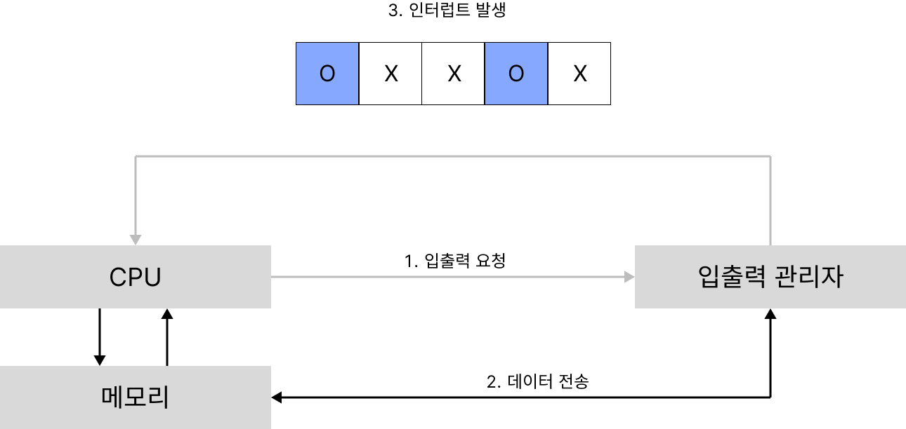

# 요약

인터럽트란 CPU가 특정 기능을 수행하는 도중에 급하게 다른 일을 처리하고자 할 때 사용할 수 있는 기능입니다.

CPU의 작업과 저장 장치의 데이터 이동을 독립적으로 운영하여 효율을 높입니다.

 
 

# 인터럽트

인터럽트란 CPU가 특정 기능을 수행하는 도중에 급하게 다른 일을 처리하고자 할 때 사용할 수 있는 기능입니다.

초기 컴퓨터 시스템에는 주변장치가 많지 않았어서 CPU가 직접 입출력장치에서 데이터를 가져오거나 보냈습니다. 이것을 폴링 방식이라고 합니다.

**폴링** 방식은 CPU가 입출력장치의 상태를 주기적으로 검사하여 일정한 조건을 만족할 때 데이터를 처리합니다. CPU가 명령어 해석과 실행이라는 본래 역할 외에 모든 입출력까지 관여해야 했으므로 효율이 좋지 않았습니다.

지금의 컴퓨터에는 많은 주변장치가 있기 때문에 폴링 방식은 매우 비효율적입니다. 이러한 문제를 해결하기 위해서 등장한 것이 **인터럽트** 방식입니다.

**인터럽트** 방식은 CPU의 작업과 저장장치의 데이터 이동을 독립적으로 운영함으로서 시스템의 효율을 높입니다.

즉, 데이터의 입출력이 이루어지는 동안 CPU는 다른 작업을 할 수 있습니다.

### 간단한 예

폴링 방식: 요리사가 요리하다가 재료가 필요하면 직접 창고에 가서 가져오는 것

인터럽트 방식: 주방 보조를 놓고 자신은 계속 요리하고 보조를 시켜서 재료를 가져오게 하는 것

 
 

# 동작과정

1. CPU가 입출력 관리자에게 입출력 명령을 보냄
2. 입출력 관리자는 명령받은 데이터를 메모리에 놓거나 메모리에 있는 데이터를 저장장치로 옮김
3. 데이터 전송이 완료되면 입출력 관리자는 완료 신호를 CPU에 보냄

여기서 CPU에 보내는 완료 신호를 `인터럽트`라고 합니다.

CPU는 입출력 관리자에게 여러 개의 입출력 작업을 동시에 시킬 수 있습니다. 이때, 여러 작업이 동시에 완료되고 그때마다 인터럽트를 여러 번 사용해야 하는데, 이것은 매우 비효율적입니다.

그래서 여러 개의 인터럽트를 하나의 배열로 만든 인터럽트 벡터를 사용합니다.

위 그림은 인터럽트의 동작 과정을 그림으로 나타낸 것입니다.

1 - 2 - 3 순서로 진행되는데, 0번째와 3번째가 동시에 인터럽트가 발생한 것을 알 수 있습니다.

CPU가 인터럽트 벡터를 받으면 0번과 3번을 동시에 처리합니다.

위 그림은 입출력 인터럽트를 나타낸 것인데, 이것말고도 다른 예시가 있습니다.

- 사용자가 컴퓨터의 전원을 눌러서 강제 종료했을 때
- 자신에게 주어지 메모리 영역을 넘어서는 작업을 하려고 할 때
- 숫자를 0으로 나누었을 때

 
 

# 직접 메모리 접근 (DMA)

입출력이 필요할 때 CPU는 입출력 관리자에게 입출력 요청을 보냅니다. 명령을 받은 입출력 관리자는 CPU가 요청한 데이터를 메모리에 가져다 놓아야 합니다. 하지만 메모리는 CPU만 접근 권한을 가지고 있기 때문에 입출력 관리자는 접근이 불가합니다.

이 문제를 해결하기 위한 권한이 직접 메모리 접근입니다

 
 

# 메모리 맵 입출력

직접 메모리 접근은 인터럽트 방식에서 필수 요소인데, 이것을 사용하면 메모리가 복잡해집니다.

메모리에는 CPU가 사용하는 데이터와 입출력 장치가 사용하는 데이터가 섞여 있고, 직접 메모리 접근을 통해 들어오는 데이터도 있습니다. 이 데이터들은 대충 놓는다면 관리하기 어렵습니다.

이를 막기 위해서 메모리를 나누어 사용하는 방법인 메모리 맵 입출력이라는 것이 도입되었습니다.

메모리 맵 입출력은 CPU가 사용하는 메모리 공간과 직접 메모리 접근을 통해 들어오고 나가는 데이터를 위한 공간을 분리한 것입니다.

→ 일정 공간을 입출력에 할당하는 기법

 
 

# 사이클 훔치기

사이클 훔치기는 CPU와 직접 메모리 접근이 동시에 메모리에 접근하면 CPU가 양보하는 것입니다.

CPU의 작업 속도가 입출력장치의 속도보다 빠르기 때문입니다.

 
 

# 참고

쉽게 배우는 운영체제 - 조성호(한빛미디어)

[https://velog.io/@hyun0310woo/7.-운영체제-인터럽트에-대해서](https://velog.io/@hyun0310woo/7.-%EC%9A%B4%EC%98%81%EC%B2%B4%EC%A0%9C-%EC%9D%B8%ED%84%B0%EB%9F%BD%ED%8A%B8%EC%97%90-%EB%8C%80%ED%95%B4%EC%84%9C)