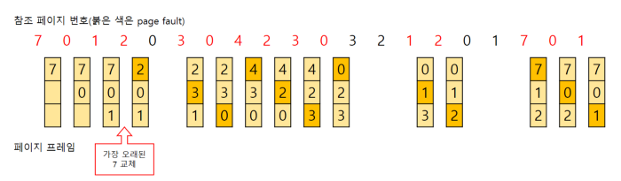
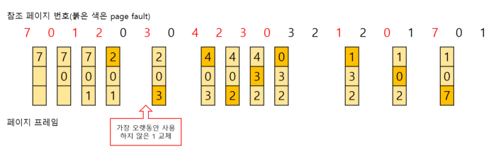
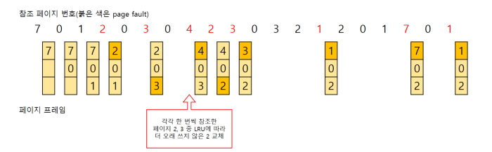
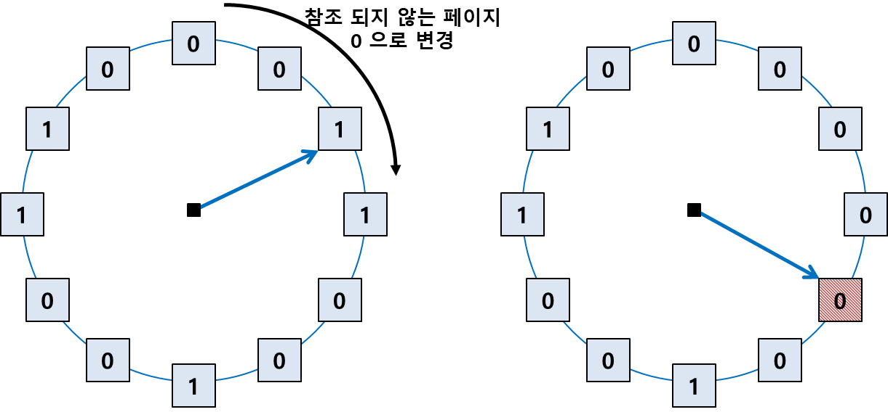

# 요약

페이지 교체 알고리즘이란 메모리 내 페이지 부재율을 최소화하기 위한 목적으로 디스크의 스왑 영역으로 보낼 페이지를 결정하는 알고리즘입니다. 페이지 교체 알고리즘에는 FIFO, LRU, LFU, NUR 등의 페이지 교체 알고리즘이 있습니다.

 

# 페이지 교체

페이지 부재가 발생하면 요청된 페이지를 디스크에서 메모리로 읽어와야 하는데, 물리 메모리에 빈 프레임이 존재하지 않는다면 메모리 내 페이지 중 하나를 선택해서 디스크의 스왑 영역으로 보내는 과정을 말합니다.

 

# 페이지 교체 알고리즘

메모리 내 페이지 부재율을 최소화하기 위한 목적으로 디스크의 스왑 영역으로 보낼 페이지를 결정하는 알고리즘입니다.

메모리에서 앞으로 사용할 가능성이 적은 페이지를 대상 페이지로 선정해서 페이지 부재를 줄이고 시스템의 성능을 향상시킵니다.

## FIFO 페이지 교체 알고리즘 (First In First Out)

- 시간상으로 메모리에 가장 먼저 들어온 페이지를 대상 페이지로 선정하여 스왑 영역으로 보냅니다.
- 큐로 쉽게 구현할 수 있습니다.
- 먼저 들어왔어도 자주 사용하게 될 페이지가 있을 수 있는데 먼저 들어온 페이지를 교체하는 알고리즘이므로 성능이 좋지 않습니다.
- 메모리 증가로 더 많은 프레임을 사용했는데도 페이지 부재 횟수가 오히려 증가하는 이상 현상인 Belady's Anomaly(FIFO Anomaly)현상이 발생 가능합니다.

## LRU 페이지 교체 알고리즘 (Least Recently Used)

- 최적 근접 알고리즘 중 하나입니다.
- 메모리에 올라온 후 가장 오랫동안 사용되지 않은 페이지를 스왑 영역으로 옮깁니다. → 최근에 사용된 페이지는 놔두고 오래전에 사용한 페이지를 대상 페이지로 선정합니다.
- 시간을 기준으로 구현할 수 있고, 카운터나 참조 비트를 이용하는 방법도 있습니다.
- 성능이 FIFO 알고리즘보다 우수하고 최적 페이지 교체 알고리즘보다는 조금 떨어집니다.
- 접근 시간이나 참조 비트를 유지하기 위한 메모리가 추가로 필요하기 때문에 낭비되는 메모리 공간이 많다는 것이 단점입니다.

## LFU 페이지 교체 알고리즘 (Least Frequently Used)

- 최적 근접 알고리즘 중 하나입니다.
- 페이지가 몇 번 사용되었는지를 기준으로 대상 페이지를 선정합니다. → 현재 프레임에 있는 페이지마다 그동안 사용된 횟수를 세어 횟수가 가장 적은 페이지를 스왑 영역으로 옮깁니다.
- LRU 페이지 교체 알고리즘과 마찬가지로 성능이 FIFO 알고리즘보다 우수하고 최적 페이지 교체 알고리즘보다는 조금 떨어집니다.
- LRU 페이지 교체 알고리즘과 마찬가지로 메모리가 추가로 필요하기 때문에 낭비되는 메모리 공간이 많다는 것이 단점입니다.

## NUR 페이지 교체 알고리즘 (Not Used Recently)

- LRU, LFU 페이지 교체 알고리즘과 성능이 비슷한데 불필요한 메모리 공간 낭비를 해결한 알고리즘입니다.
- 페이지마다 참조, 변경 비트를 가지므로 추가되는 메모리 공간이 2비트입니다. (참조비트, 변경비트)
    - 참조 비트: 페이지에 접근하면 1
    - 변경 비트: 페이지가 변경되면 1
- 대상 페이지를 선정하는 기준은 가장 먼저 (0, 0)인 페이지를 선정합니다. (0, 0)이 없다면 (0, 1) → (1, 0) → (1, 1) 순서로 선정합니다. 만약 같은 비트의 페이지가 여러 개라면 무작위로 대상 페이지를 선정합니다.
- 만약 모든 페이지가 (1, 1)이라면 모든 페이지 비트를 (0, 0)으로 초기화합니다. 또한 (0, 0)인 페이지가 여러 개라면 가장 위에 있는 페이지를 대상 페이지를 선정합니다.
- 2bit만 추가하여 다른 알고리즘과 유사한 성능을 내고 쉽게 구현할 수 있어서 가장 많이 사용되는 알고리즘입니다.

 

# 참고

쉽게 배우는 운영체제 - 조성호, 한빛미디어

[https://zu-techlog.tistory.com/134#MFU-Most%--Frequently%--Used-](https://zu-techlog.tistory.com/134#MFU-Most%25--Frequently%25--Used-)