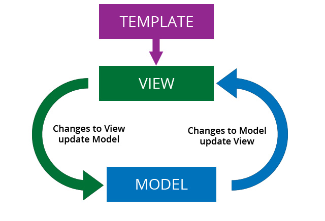

# 단방향 바인딩과 양방향 바인딩

‘데이터 바인딩’이라는 용어는 JavaScript뿐만 아니라 컴퓨터 과학에서 범용적으로 사용되는 단어입니다.

보통 ‘데이터 바인딩’이라고 하면 응용프로그램의 UI 요소와 소스 코드의 데이터를 서로 연결하는 행위를 말합니다. 웹의 관점에서 해석을 하자면 **화면상에 보여지는 데이터(View)**와 **브라우저 메모리에 있는 데이터(Model)**를 묶어서(Binding) 서로 간의 데이터를 동기화하는 것을 의미합니다.

예를 들어 HTML 상에서 버튼 클릭 혹은 어떤 이벤트가 발생하는 행위를 했을 때 데이터 값이 변경되어 변경된 값에 대응되는 UI 요소로 바뀌는 동작을 ‘데이터 바인딩’이라고 합니다.

이러한 데이터 바인딩에는 ‘단방향 바인딩’과 ‘양방향 바인딩’이 있습니다.

### 단방향 바인딩

단방향 바인딩은 데이터가 오직 한 방향으로 흐르는 것을 의미합니다.

단방향 바인딩을 `one-way data flow` 혹은 `undeirectional data flow` 라고 부릅니다. 대표적으로 자바스크립트에서 리액트가 단방향 데이터 흐름을 채택하고 있습니다.

위의 그림을 보면 Events, State, View 3개로 이루어진 원이 있습니다. 이 3가지의 원은 서로 한 방향으로 화살표로 표시하고 있고, 이 화살표가 연결된 3가지의 원들이 앱을 구성하는 요소들입니다.

리액트에서 유저가 화면을 통해 이벤트를 발생시키면 컴포넌트의 상태가 변경되고 뷰가 업데이트 됩니다. 이처럼 리액트 컴포넌트 내에서 ‘단방향 데이터 바인딩’은 **Javascript(Model)에서 HTML(View)로 한 방향으로만 데이터를 동기화하는 것을 의미**합니다.

컴포넌트 간에서 단방향 데이터 바인딩은 부모 컴포넌트에서 자식 컴포넌트로만 데이터가 전달되는 구조입니다.

### 양방향 데이터 바인딩

양방향 데이터 바인딩은 데이터가 양쪽 방향으로 모두 흐르는 것을 의미합니다.

위의 그림처럼 뷰에서 데이터가 변경되면 동시에 모델에서도 데이터가 변경됩니다. 반대로 데이터가 모델에서 변경되면 뷰에서도 반영이 되어 업데이트됩니다.

이처럼 둘 중 하나의 데이터만 변경 되어도 함께 변경되는 것이 양방향 데이터 바인딩입니다. 자바스크립트의 SPA 프레임워크 중 뷰와 앵글러에서 양방향 데이터 바인딩을 사용합니다.

### 왜 리액트는 단방향 바인딩을 채택했을까?

아무래도 가장 큰 이유는 리액트는 View의 로직만 관리하는 자바스크립트의 라이브러리이기 때문입니다. 다른 SPA 프레임워크 중 Vue.js의 경우 뷰와 모델을 함께 관리하는 MVVM 디자인 패턴을 주로 사용하기 때문에 양방향 데이터 바인딩을 채택해 사용하고 있죠.

그렇다면 왜 페이스북은 View의 로직만 관리하는 리액트를 만든 것일까요? 양방향 바인딩의 경우 유지보수 비용이 큽니다. 앱이 점점커지고 사용자가 늘어날수록 유저 상호작용이 많이 발생하고 복잡성이 증가해 데이터의 흐름이 어디로 이어지는지 파악하기 어려우며 디버깅도 어려워집니다. 또한 모델과 뷰가 서로 의존 관계이기 때문에 재사용성도 떨어집니다.

이전에 페이스북도 양방향 데이터 흐름을 가진 MVC 패턴을 이용해 개발을 하였고 UI가 쉽게 무너지고 빠르게 수정하는 것이 어려운 문제에 직면해 있었습니다. 가장 유명한 알림 버그 등과 같은 유사한 문제들이 많아 React를 개발하고 도입한 것으로 알고 있습니다.

반면에 단방향 바인딩의 경우 유지보수 비용이 작고 특히 리액트에서는 개발자가 상태 관리 및 Prop에 대한 특정 규칙을 준수하여 컴포넌트를 작성하기 때문에 단순하게 유지하도록 코드가 직관적인 장점이 있습니다. 데이터가 어디서 어디로 흐르는지 명확히 알 수 있으며 재사용성이 뛰어납니다.

리액트에서 양방향 데이터 바인딩을 지원하지는 않지만 자식 컴포넌트에서도 부모 컴포넌트의 상태를 변경할 수 있습니다. 리액트 공식 문서에서 설명하는 리액트처럼 사고하기(Thinking in react)에서 [역 데이터 흐름](https://react.dev/learn/thinking-in-react#step-5-add-inverse-data-flow)(inverese data flow) 부분을 살펴보시면 됩니다.

### 요약

**단방향 데이터 바인딩**

- 데이터가 한 방향으로 흐르는 것을 의미
- 유지보수 비용이 적음
- 재사용성이 뛰어남
- 데이터의 흐름을 명확히 파악할 수 있음

**양방향 데이터 바인딩**

- 데이터가 양방향으로 흐르는 것을 의미
- 앱이 커질수록 유지보수 비용이 큼
- 재사용성이 뛰어나지 않음
- 앱이 커질수록 데이터의 흐름을 파악하기 힘듬

[참고 사이트]

https://adjh54.tistory.com/49

https://www.youtube.com/watch?v=2Fr69gOLpAA&t=14s

https://stackoverflow.com/questions/13504906/what-is-two-way-binding

https://dev.to/laserreindeer/one-way-data-flow-why-47fk

https://moonsupport.oopy.io/post/26
