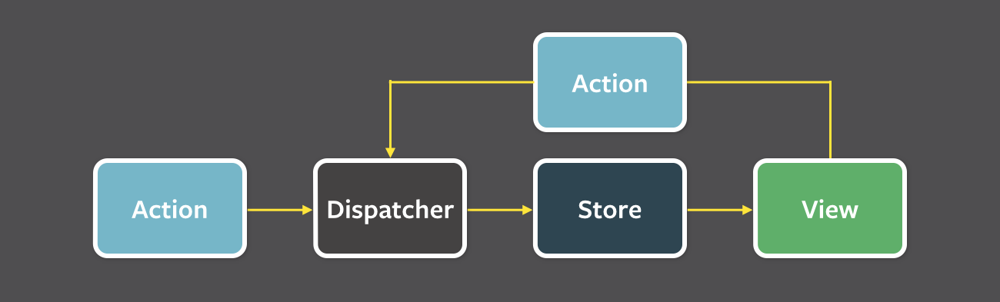

### 리액트 상태관리 라이브러리

리액트에서 상태관리 라이브러리 도구들은 Redux, Recoil, Mobx, zustand, zotai 등이 있다. 한국에서는 주로 Redux를 사용하며 Recoil도 가끔 사용한다. 대표적으로 많이 사용하는 Redux, Recoil에 대해서 알아보자.

### Redux

리덕스(Redux)의 구조는 단방향으로 데이터가 흐르는 Flux 패턴을 기반으로 상태 데이터를 관리한다.

이러한 리덕스의 구조는 상태(state)를 저장하는 Stroe, 상태를 조작하는 Reducer, Action을 전달하는 Dispatcher 함수로 이루어져 있다.

모든 데이터는 중앙 허브인 dispatcher를 통해 흐르며 action은 dispatcher에게 action creator 메소드를 제공하는데 대부분의 action은 view에서의 사용자 상호작용에서 발생한다.

dispatcher는 store를 등록하기 위한 콜백을 실행한 이후에 action을 모든 store로 전달한다. 등록된 콜백을 활용해 store는 관리하고 있는 상태 중 어떤 액션이라도 관련이 있다면 전달해준다.

store는 *change* 이벤트를 controller-views에게 알려주고 그 결과로 데이터 계층에서의 변화가 일어난다. Controller-views는 이 이벤트를 듣고 있다가 이벤트 핸들러가 있는 store에서 데이터를 다시 가져온다. controller-views는 스스로의 `setState()` 메소드를 호출하고 컴포넌트 트리에 속해 있는 자식 노드 모두를 다시 랜더링하게 한다.

여기서 Controller-views는 변경 이벤트를 듣고 새로운 데이터를 store에서 가져온 후 모든 트리에 있는 자식 view에게 새로운 데이터를 제공하는 view를 말한다.

Redux는 다음과 같은 순서로 상태를 관리한다.

1. 상태가 변경되어야 하는 이벤트가 발생하면, 변경될 상태에 대한 정보가 담긴 **Action 객체**가 생성됩니다.
2. 이 Action 객체는 **Dispatch 함수**의 인자로 전달됩니다.
3. Dispatch 함수는 Action 객체를 **Reducer 함수**로 전달해 줍니다.
4. Reducer 함수는 Action 객체의 값을 확인하고, 그 값에 따라 **전역 상태 저장소 Store**의 상태를 변경합니다.
5. 상태가 변경되면, React는 화면을 다시 렌더링 합니다.

### Recoil

리코일은 아토믹(atomic)하게 상태를 관리하는 상태 관리 라이브러리이다. 리코일을 상요하면 atoms(공유 상태)에서 selectors(순수 함수)를 거쳐 React 컴포넌트로 내려가는 data-flow graph를 만들 수 있다. Atoms는 컴포넌트가 구독할 수 있는 상태의 단위이고 Selectors는 atoms 상태 값을 동기 또는 비동기 방식을 통해 변환한다.

### Atoms

Atoms는 상태의 단위이며, 업데이트와 구독이 가능하다. atom이 업데이트되면 각각 구독된 컴포넌트는 새로운 값을 반영하여 다시 렌더링 된다. atoms는 런타임에서 생성될 수도 있다. Atoms는 React의 로컬 컴포넌트의 상태 대신 사용할 수 있다. 동일한 atom이 여러 컴포넌트에서 사용되는 경우 모든 컴포넌트는 상태를 공유한다.

### Selectors

Selector는 atoms나 다른 selectors를 입력으로 받아들이는 순수 함수이다. 상위의 atoms 또는 selectors가 업데이트되면 하위의 selector 함수도 다시 실행된다. 컴포넌트들은 selectors를 atoms처럼 구독할 수 있으며 selectors가 변경되면 컴포넌트들도 다시 렌더링 된다.

Selectors는 상태를 기반으로 하는 파생 데이터를 계산하는 데 사용된다. 최소한의 상태 집합만 atoms에 저장하고 다른 모든 파생되는 데이터는 selectors에 명시한 함수를 통해 효율적으로 계산함으로써 쓸모없는 상태의 보존을 방지한다.

Recoil의 Selector의 개념은 다른 상태 관리 라이브러리와의 개념과 조금 다른다고 한다. Redux의 `reselect`와 Mobx의 `@computed` 처럼 동작하는 “get” 함수를 가지고 있다.

“get” 함수는 인자를 통해 atoms와 다른 selectors에 접근할 수 있다. 다른 atoms나 selectors에 접근하면 자동으로 종속 관계가 생성되므로, 참조했던 다른 atoms나 selectors가 업데이트되면 이 함수도 다시 실행된다.

[참고사이트]

- 리덕스

https://22yuu.tistory.com/49

https://haruair.github.io/flux/docs/overview.html

- 리코일

https://recoiljs.org/ko/docs/introduction/core-concepts

https://ui.toast.com/weekly-pick/ko_20200616
