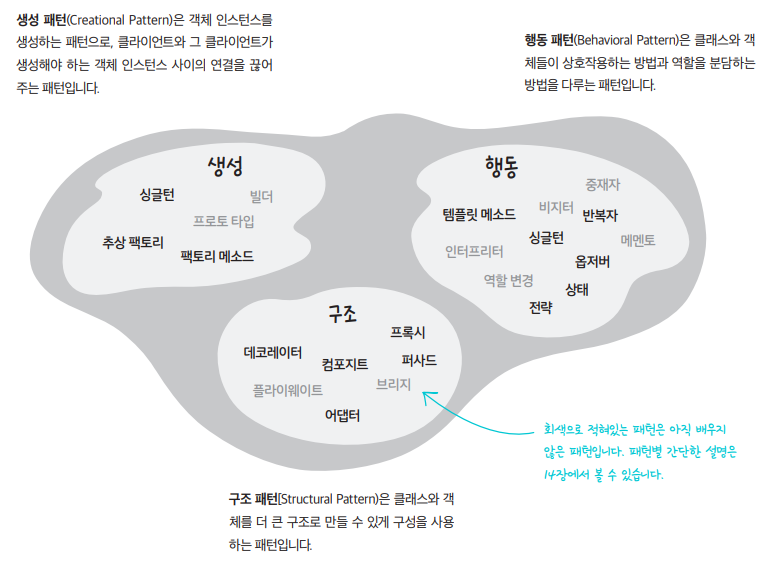

### 디자인 패턴

디자인 패턴이란 소프트웨어 디자인 과정에서 자주 발생하는 문제들에 대한 전형적인 해결책으로 코드에서 반복되는 디자인 문제들을 해결하기 위해 맞춤화할 수 있는 미리 만들어진 청사진과 비슷하다.

패턴은 알고리즘과 자주 혼동되지만 서로 명백히 다른 개념이다. 알고리즘은 어떤 목표를 달성하기 위해 따라야 할 명확한 일련의 절차를 정의하지만, 패턴은 해결책에 대한 더 상위 수준의 설명으로 결과와 기능들은 제시하나 구현 단계 및 순서는 개발자가 결정한다.

많은 문제들을 디자인 패턴을 이용해 해결할 수 있지만 너무 맹신해서는 안된다. 모든 문제를 패턴을 사용해서 해결하려 드는 패턴병에 걸리지 않도록 조심하자.

디자인 패턴보다 중요한 것은 코드베이스의 간결성. 즉, 디자인 패턴 적용이 굳이 필요가 없으면 적용하지 않는게 좋다. 그 패턴이 왜 효율적인 방식인지를 이해하며 필요에 따라 상황에 맞게 사용해야 한다. 디자인 패턴은 모든 상황의 해결책이 아니라는 것을 명심하자.

**디자인 패턴 용도에 따라 나누기**

대부분의 카탈로그에서는 몇 가지 범주에 맞춰서 디자인 패턴을 분류하고 있습니다. 그중 제일 유명한 분류 방법은 맨 처음 출간되었던 **패턴 카탈로그에서 제시한 생성, 행동, 구조라는 3가지 범주로 용도에 따라 나누기**입니다.

[참고 사이트]

https://refactoring.guru/ko/design-patterns/what-is-pattern

[https://namu.wiki/w/디자인 패턴](https://namu.wiki/w/%EB%94%94%EC%9E%90%EC%9D%B8%20%ED%8C%A8%ED%84%B4)

https://m.hanbit.co.kr/channel/category/category_view.html?cms_code=CMS8616098823
